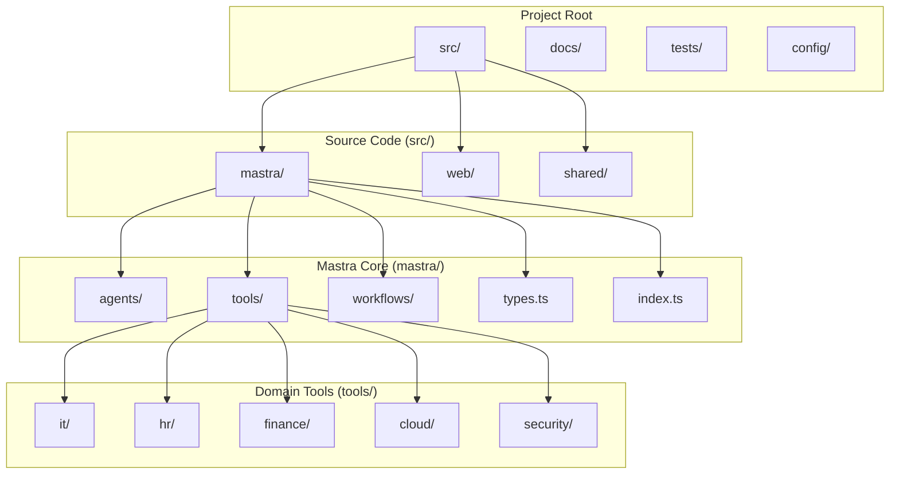
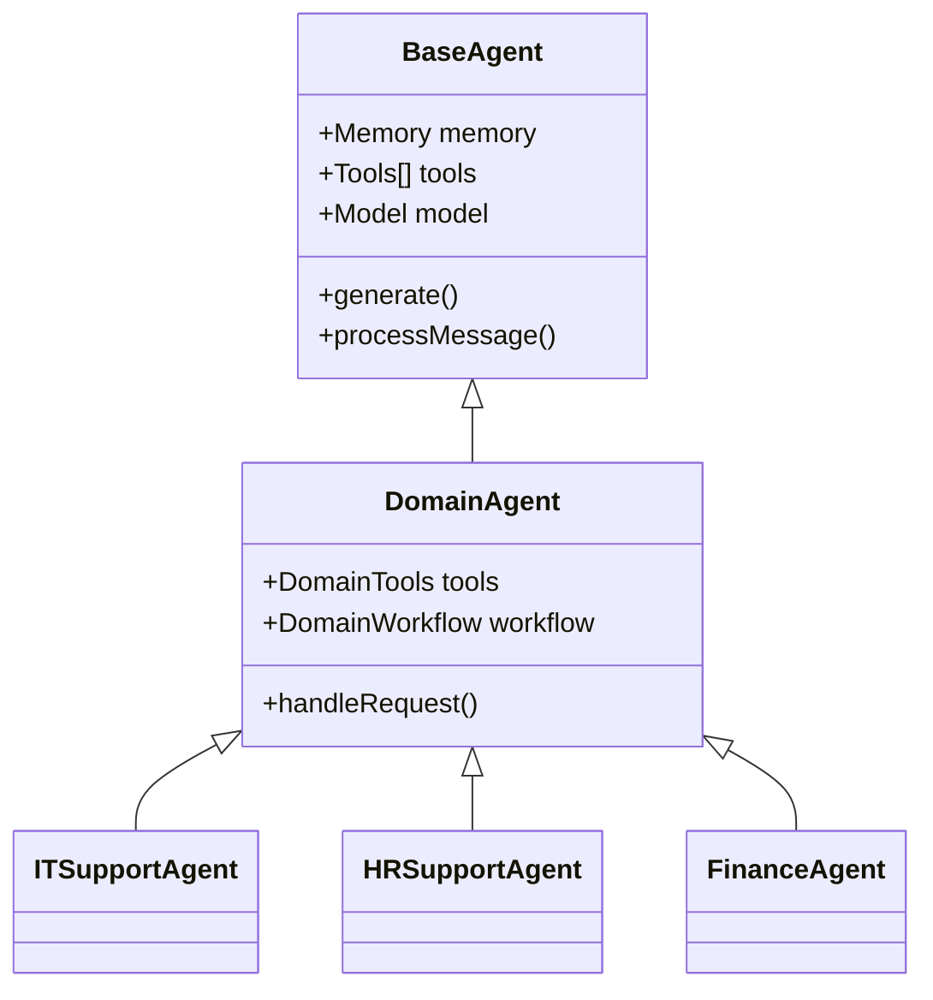
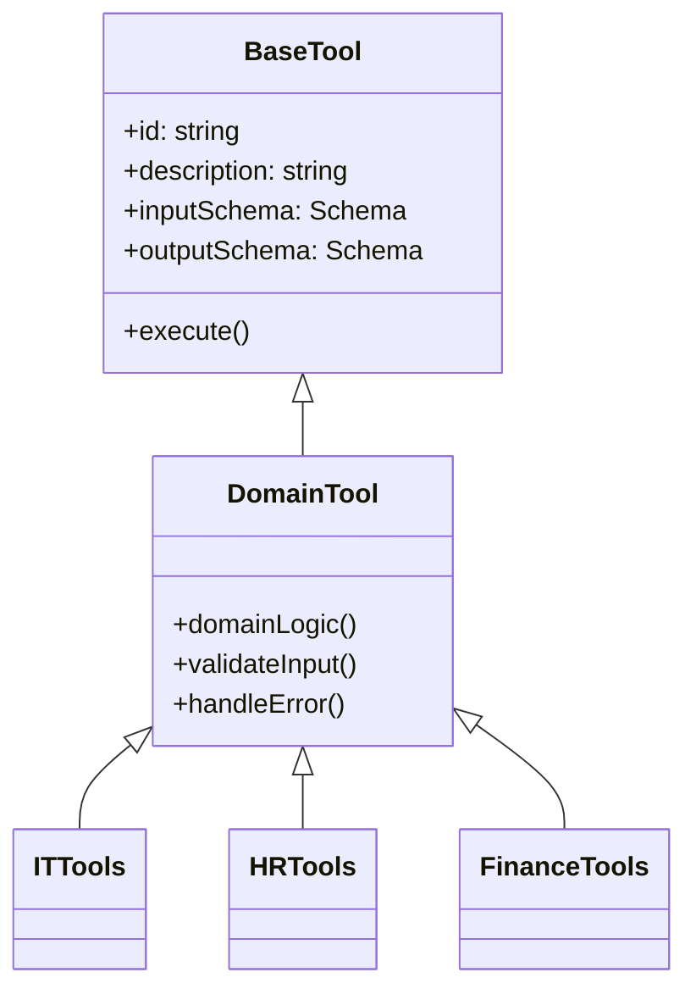
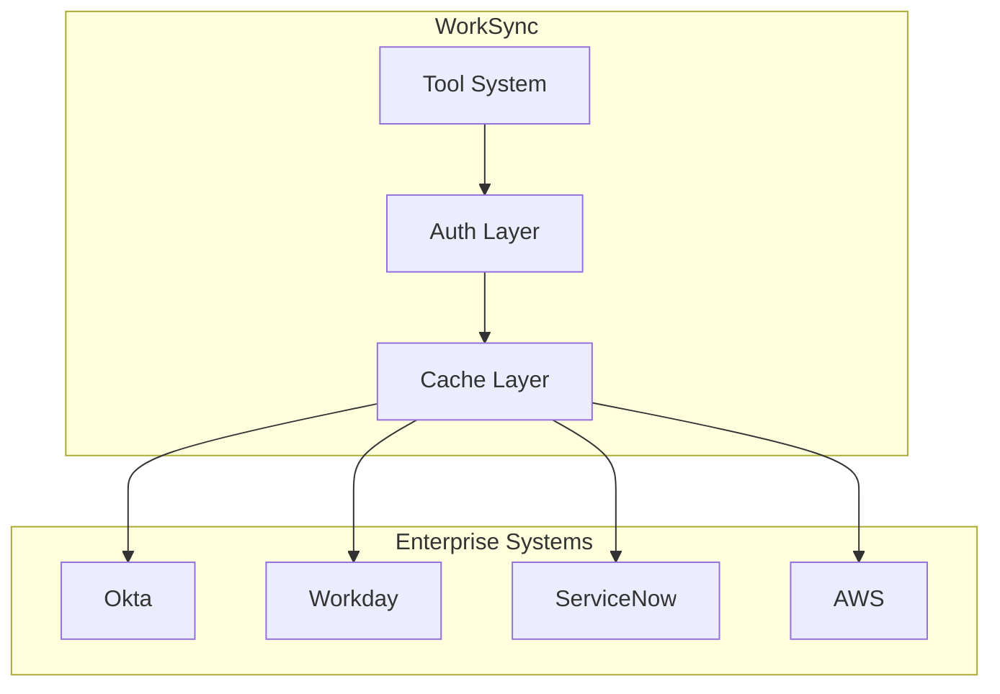
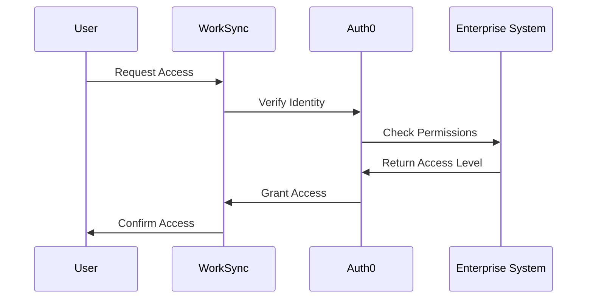
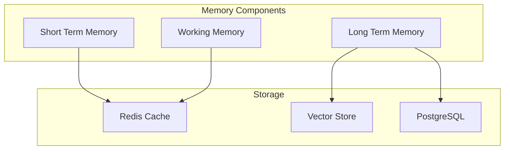
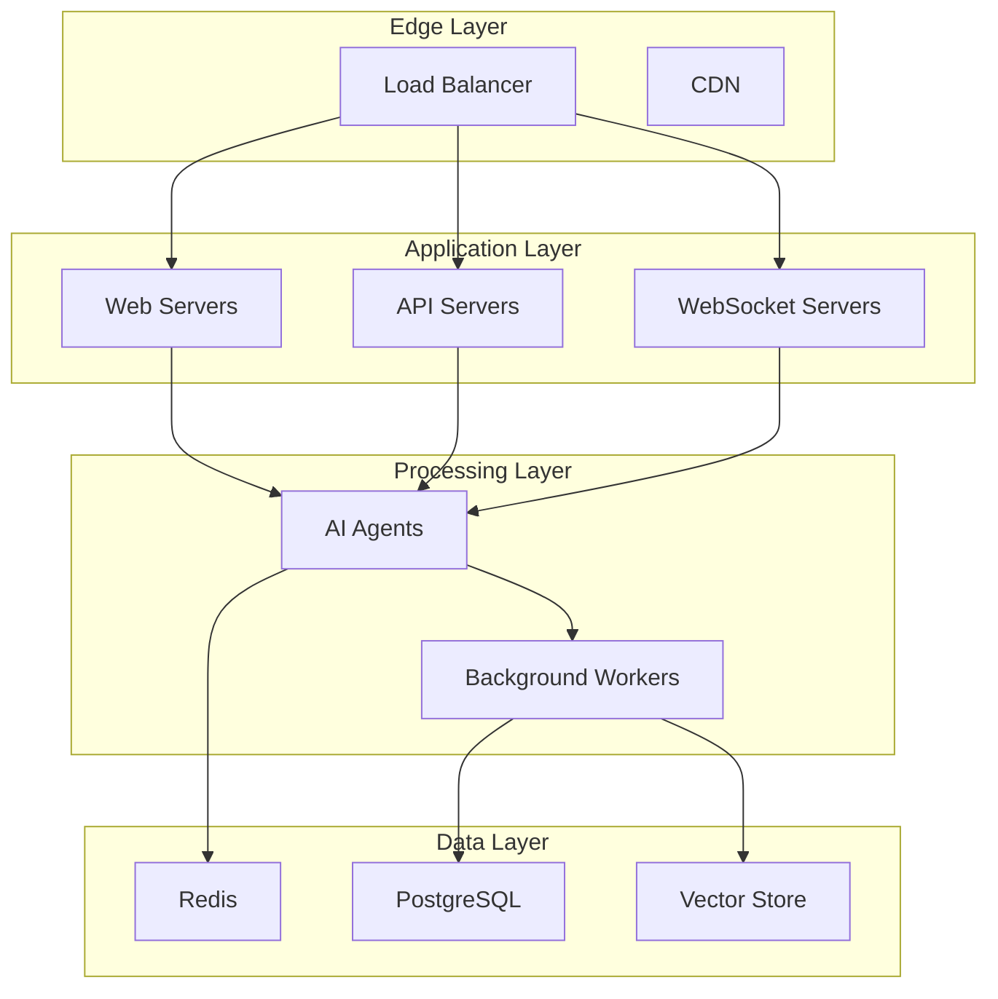

# WorkSync Technical Architecture

## Project Structure 📁



## Directory Structure Details 📂

```
worksync-ai/
├── src/
│   ├── mastra/                 # Core AI functionality
│   │   ├── agents/            # AI agents by domain
│   │   │   ├── index.ts
│   │   │   ├── itSupportAgent.ts
│   │   │   ├── hrSupportAgent.ts
│   │   │   ├── financeSupportAgent.ts
│   │   │   ├── cloudOpsAgent.ts
│   │   │   └── securityAgent.ts
│   │   ├── tools/             # Domain-specific tools
│   │   │   ├── it/           # IT support tools
│   │   │   ├── hr/           # HR management tools
│   │   │   ├── finance/      # Financial tools
│   │   │   ├── cloud/        # Cloud operations tools
│   │   │   └── security/     # Security tools
│   │   ├── workflows/         # Domain workflows
│   │   ├── types.ts          # Type definitions
│   │   └── index.ts          # Main entry point
│   ├── web/                   # Web interface
│   └── shared/                # Shared utilities
├── docs/                      # Documentation
├── tests/                     # Test suites
└── config/                    # Configuration files
```

## Component Architecture 🏗️

### 1. Agent Layer



### 2. Tool System 🛠️



## Integration Architecture 🔌

### 1. Enterprise System Integration



### 2. Authentication Flow 🔐



## Memory System 🧠



## Development Guidelines 📝

### 1. Code Organization

- Follow domain-driven design principles
- Keep tools focused and single-purpose
- Use TypeScript for type safety
- Document all public interfaces

### 2. Best Practices

- Use dependency injection
- Write unit tests for all tools
- Follow error handling patterns
- Implement proper logging

### 3. Security Guidelines

- Never store credentials in code
- Use environment variables
- Implement rate limiting
- Log security events

## Performance Considerations 🚀

### 1. Caching Strategy

- Use Redis for short-term memory
- Implement request caching
- Cache enterprise system responses

### 2. Scaling

- Horizontal scaling of agents
- Load balancing for requests
- Database sharding strategy

## Monitoring and Logging 📊

### 1. Metrics

- Request latency
- Tool usage statistics
- Error rates
- System health

### 2. Logging

- Request/response logging
- Error tracking
- Audit trail
- Performance metrics

## Deployment Architecture 🌐



## Error Handling 🚨

### 1. Error Types

- User input errors
- System errors
- Integration errors
- Security errors

### 2. Recovery Strategies

- Automatic retry logic
- Fallback mechanisms
- Human escalation paths

## Future Considerations 🔮

1. **Scaling**
   - Microservices architecture
   - Event-driven processing
   - Global distribution

2. **Features**
   - Custom workflow builder
   - Advanced analytics
   - ML model fine-tuning

3. **Integration**
   - More enterprise systems
   - Custom tool development
   - Advanced security features 